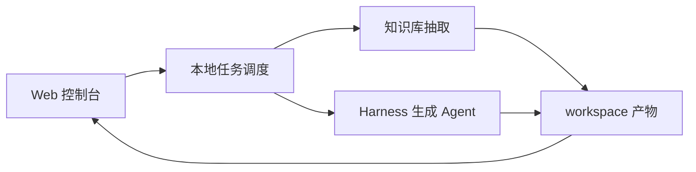

# AxF 精简架构

AxF 当前只保留一条清晰的本地流水线：

```text
Web 控制台 -> 任务调度 -> 知识库抽取 -> Agent 生成 -> workspace 产物
```

## 分层

### 1. 前端层

位置：`frontend/`

职责：

- 提供本地 Web 控制台。
- 收集源码路径、函数名、文件过滤、模型配置和产物选择。
- 展示任务状态、日志和产物。

前端不直接拼 prompt，不直接解析模型响应，也不负责构建或执行 fuzz target。

### 2. 任务调度层

位置：`frontend/server.py`

职责：

- 把一次用户提交转换为线性步骤。
- 顺序执行知识抽取命令和 Agent 命令。
- 将任务状态、事件、日志和产物路径写入 `workspace/web/tasks/<task_id>/`。

当前调度保持简单：单进程、本地线程、顺序执行。后续需要并发、队列、重试或暂停时，再独立抽出 `scheduler/`。

### 3. 知识库层

位置：`knowledge_base/`

职责：

- 基于 `BROWSE.VC.DB` 查询目标函数。
- 生成 `report.json`。
- 生成目标函数和下游子函数源码包。
- 输出上层调用链和参数约束。

知识库层只产出上下文，不生成 harness。

### 4. Agent 层

位置：`agents/`

当前 Agent：

- `agents/harness_generation/`：基于知识库产物和 LLM 生成 `libFuzzer` harness。

后续 Agent 作为同级目录增加，例如：

- `agents/harness_execution/`
- `agents/crash_analysis/`
- `agents/seed_generation/`

每个 Agent 都应该有独立命令行入口，前端或调度层只通过命令参数和文件产物与它交互。

### 5. 产物层

位置：`workspace/`

职责：

- 保存任务输入、事件、日志和产物。
- 避免污染源码树、Linux 源码和知识库代码。

典型任务目录：

```text
workspace/web/tasks/<task_id>/
  task.json
  task.log
  events.jsonl
  report.json
  <function>_subsource_bundle.c
  calls.txt
  params.txt
  generated_harness.txt
  harness/
    harness.c
    mocks.h
    mocks.c
    build.sh
    build.ps1
    harness_spec.json
```

## 当前执行流



## 设计原则

- 本地优先：源码、任务和产物都保存在本机。
- 边界清楚：前端调度任务，知识库抽取上下文，Agent 生成结果。
- 文件协议优先：早期用文件连接组件，避免过早引入数据库和服务拆分。
- Agent 可插拔：新增 Agent 时只新增目录、入口和产物映射，不改知识库核心。
- 不修改外部源码：不改 Linux 源码，不改 kRepo 来源代码，只写 `workspace/`。
